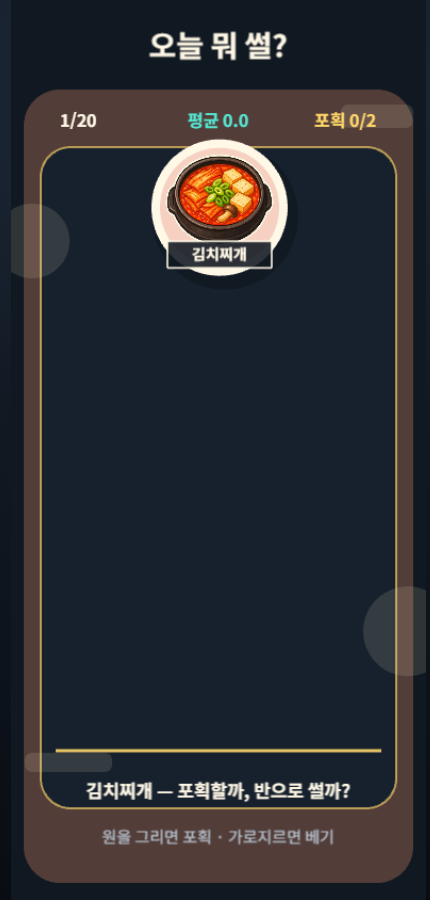

# 대표 음식 5종 비주얼 슬라이스

- 작업일: 2026-08-01
- 목적: 색상 원과 글자로 표시하던 음식 토큰을 실제 음식 스티커 이미지로 교체하기 전에 5종으로 화풍·가독성·용량·런타임 연결을 검증
- 사용 도구: Codex 내장 ImageGen(도구가 세부 모델명은 노출하지 않음), Codex 이미지 생성 스킬의 크로마키 제거 도구, Pillow WebP 후처리
- 생성 방식: 메뉴별 이미지 생성 1회, 라면 이미지를 나머지 4종의 화풍 기준으로 사용

## 생성 대상

| 메뉴 ID | 메뉴명 | 최종 파일 |
|---|---|---|
| `ramyeon` | 라면 | `src/assets/food/ramyeon.webp` |
| `kimchi-jjigae` | 김치찌개 | `src/assets/food/kimchi-jjigae.webp` |
| `sushi` | 초밥 | `src/assets/food/sushi.webp` |
| `fried-chicken` | 치킨 | `src/assets/food/fried-chicken.webp` |
| `pizza` | 피자 | `src/assets/food/pizza.webp` |

## 공통 프롬프트

```text
Use case: stylized-concept
Asset type: mobile arcade game food sticker sprite
Scene/backdrop: perfectly flat solid #ff00ff chroma-key background for local background removal
Style/medium: polished high-saturation 2D mobile arcade food sticker, vector-like painted shapes, crisp cream-colored outer outline, simple readable details
Composition/framing: centered single dish, slight three-quarter top-down view, square composition, generous even padding, full silhouette entirely visible
Lighting/mood: bright, cheerful, punchy, minimal internal shading
Constraints: one uniform #ff00ff background; no shadows, gradients, texture, reflection, text, logo, brand, watermark, hands, or people; do not use #ff00ff in the subject
Avoid: photorealism, clutter, translucent steam, glow, soft shadow, cropped dish
```

## 메뉴별 추가 지시

| 메뉴 ID | 추가한 내용·실루엣 지시 |
|---|---|
| `ramyeon` | 검은 그릇, 붉은 국물과 꼬불면, 반숙 달걀, 파, 김 한 장 |
| `kimchi-jjigae` | 검은 뚝배기, 선명한 붉은 국물, 김치 잎, 두부, 파 |
| `sushi` | 검은 타원 접시, 연어·참치·새우·김을 포함한 서로 다른 초밥 5점 |
| `fried-chicken` | 검은 그릇, 금빛의 바삭한 치킨 조각, 작은 초록 가니시 |
| `pizza` | 원형 피자 전체, 토마토·버섯·올리브·피망 토핑, 조각 경계가 보이는 실루엣 |

라면 이후 4종에는 라면 결과 이미지를 화풍 참조로 함께 제공하되, 음식 구성은 위의 메뉴별 지시로 새로 생성했다.

## 사람의 검토와 후처리

1. 음식이 96px 전후에서도 구분되는지 확인했다.
2. 문자·브랜드·워터마크·인물·손이 없는지 확인했다.
3. 첫 후보는 소프트 매트(투명 12·불투명 220)와 despill을 적용했으나 붉은 국물·치킨·피자가 옅어져 기각했다.
4. 최종본은 공식 `remove_chroma_key.py`의 border 자동 키와 하드 키 tolerance 45를 사용하고 despill을 제외해 원본의 빨강·주황을 보존했다.
5. 피사체를 가운데 정렬해 512×512 투명 캔버스에 배치하고 WebP 품질 76으로 저장했다.
6. 최종 크기는 라면 41,182B, 김치찌개 34,364B, 초밥 25,404B, 치킨 43,492B, 피자 47,004B이며 합계 191,446B다.
7. 다섯 파일의 512×512 규격, WebP 알파 청크, 각 120KB 미만·합계 250KB 미만을 자동 테스트하고 네 모서리 알파 0을 후처리 단계에서 검사했다.
8. 이미지 실루엣은 판정에 사용하지 않고 기존의 동일 반지름 원형 판정을 유지한다.

## 실제 플레이 화면 검증



고정 시드 7의 첫 라운드를 430×900 Chromium 화면에서 캡처했다. `kimchi-jjigae` 이미지가 Phaser 텍스처로 등록되고 2,600ms 초반 속도 구간, 메뉴명 라벨, 기존 원형 판정을 함께 유지하는지 자동 검사와 육안 검토로 확인했다.

## 채택 판단

- 채택: 다섯 메뉴 모두 같은 외곽선·시점과 선명한 고유색을 유지하며 작은 결과 카드에서도 구분 가능
- 제한: 이번 단계는 화풍 검증용 5종 수직 슬라이스이며 나머지 45종은 기존 색상·메뉴명 폴백을 유지
- 다음 검토: 실제 모바일 화면에서 47px 결과 카드와 약 100px 낙하 토큰의 식별성을 확인한 뒤 같은 방식으로 45종을 확장

## 사용 권한 확인

- 확인일: 2026-08-01
- 근거: [OpenAI Terms of Use](https://openai.com/policies/terms-of-use/)의 Content 항목(2026-01-01 시행본)
- 확인 내용: 사용자와 OpenAI 사이에서는 사용자가 Output을 소유한다고 규정하지만, Output이 고유하지 않을 수 있고 Input·Output의 적법성 및 용도 적합성 검토 책임은 사용자에게 있다. 따라서 생성물은 사람의 선별·수정·유사성 검토를 거쳐 반영했다.
- 제출 전 해커톤 규정과 당시 적용 약관을 다시 확인한다.
